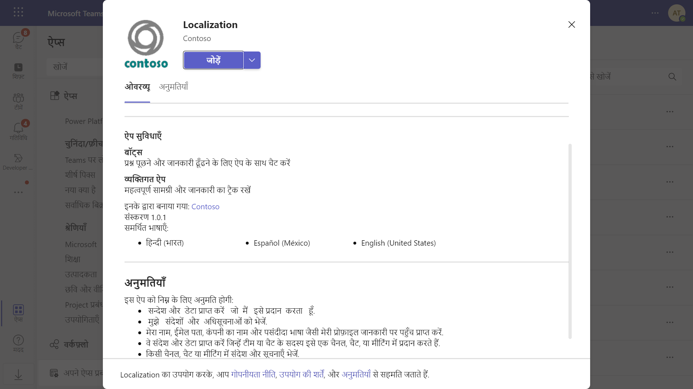
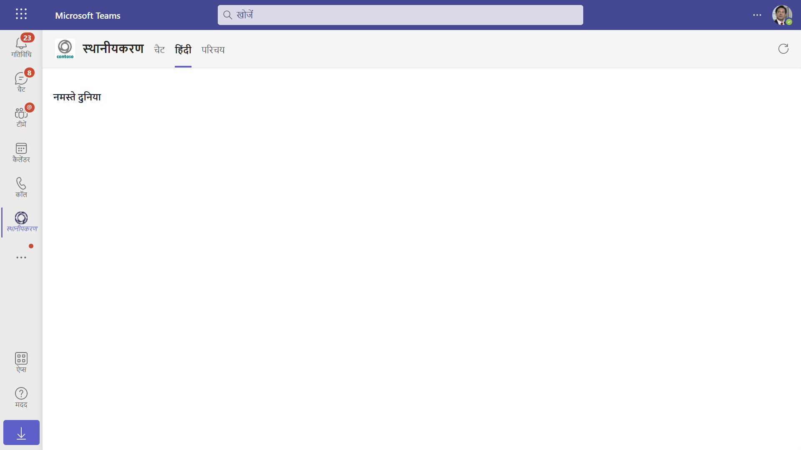
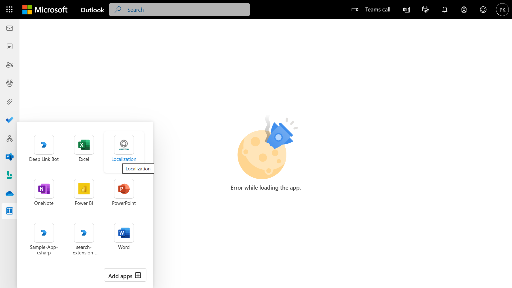
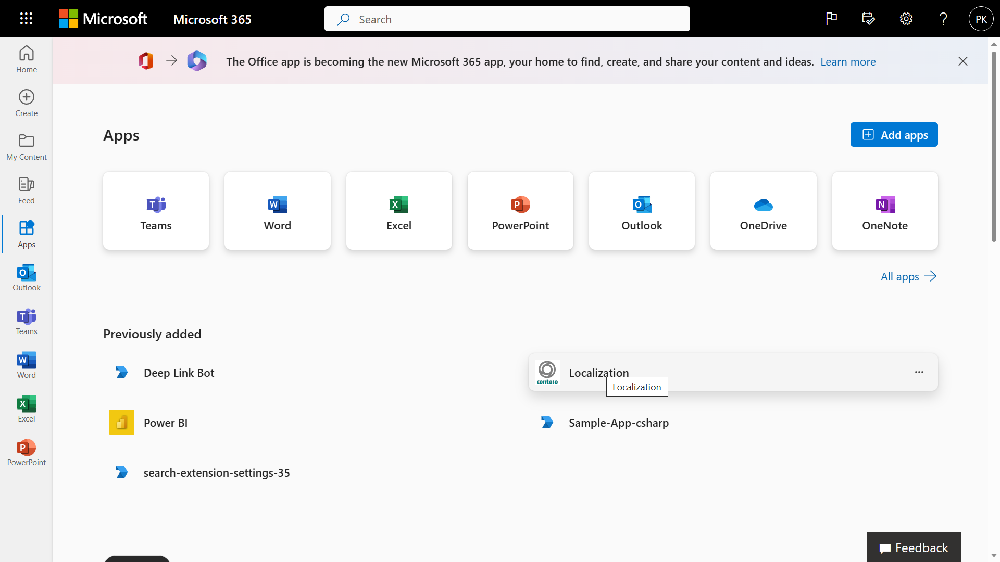
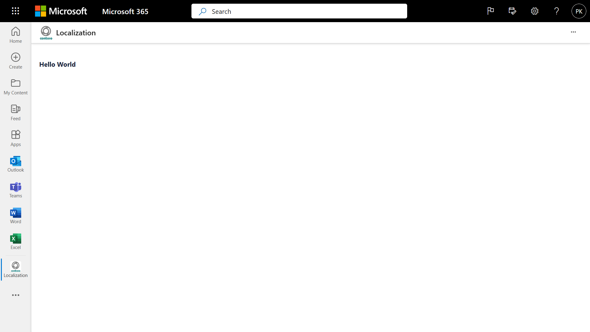

# Teams App Localization
This sample illustrates how to implement [Localization for Microsoft Teams apps](https://docs.microsoft.com/microsoftteams/platform/concepts/build-and-test/apps-localization).

## Interaction with app


## Included Features
* Azure Bot
* Teams Tab
* Localization

## Try it yourself - experience the App in your Microsoft Teams client
Please find below demo manifest which is deployed on Microsoft Azure and you can try it yourself by uploading the app package (.zip file link below) to your teams and/or as a personal app. (Sideloading must be enabled for your tenant; [see steps here](https://docs.microsoft.com/microsoftteams/platform/concepts/build-and-test/prepare-your-o365-tenant#enable-custom-teams-apps-and-turn-on-custom-app-uploading).).

**App Localization:** [Manifest](/samples/app-localization/csharp/demo-manifest/app-localization.zip)

## Prerequisites

Verify you have the right account for building Teams apps and install some recommended development tools.

- You need a Teams account that allows [custom app sideloading](https://docs.microsoft.com/microsoftteams/platform/build-your-first-app/build-first-app-overview#set-up-your-development-account).
- [.NET Core SDK](https://dotnet.microsoft.com/download) version 6.0
- [ngrok](https://ngrok.com/download) or equivalent tunnelling solution

## Setup
1. Register a new application in the [Azure Active Directory – App Registrations](https://go.microsoft.com/fwlink/?linkid=2083908) portal.
    > NOTE: When you create your app registration, you will create an App ID and App password (Secret) - make sure you keep these for later.

2. Setup for Bot
	
	- Also, register a bot with Azure Bot Service, following the instructions [here](https://docs.microsoft.com/azure/bot-service/bot-service-quickstart-registration?view=azure-bot-service-3.0)
	- Ensure that you've [enabled the Teams Channel](https://docs.microsoft.com/azure/bot-service/channel-connect-teams?view=azure-bot-service-4.0)
	- While registering the bot, use `https://<your_ngrok_url>/api/messages` as the messaging endpoint.

3. Setup NGROK
      - Run ngrok - point to port 3978

	```bash
	ngrok http -host-header=rewrite 3978
	```   

4. Setup for code

  - Clone the repository

    ```bash
    git clone https://github.com/OfficeDev/Microsoft-Teams-Samples.git
    ```
  - Modify the `/appsettings.json` and fill in the following details:
  - `{{MicrosoftAppId}}` - Generated from Step 1 while doing AAd app registration in Azure portal.
  - `{{ClientSecret}}` - Generated from Step 1, also referred to as Client secret

- Run the bot from a terminal or from Visual Studio:

5. If you are using Visual Studio
  - Launch Visual Studio
  - File -> Open -> Project/Solution
  - Navigate to `app-localization\csharp` folder
  - Select `Localization.csproj` file

6. This step is related to Microsoft Teams app manifest
    - **Edit** the `manifest.json` contained in the `Manifest` or `Manifest_hub` folder to replace your Microsoft App Id (that was created when you registered your bot earlier) *everywhere* you see the place holder string `<<YOUR-MICROSOFT-APP-ID>>` and <<Azure Bot ID>> and for the contentUrl "<<1234.ngrok.io>>?culture={locale}" (depending on the scenario the Microsoft App Id may occur multiple times in the `manifest.json`)
    - **Provide ngrok Url** (turnnelling Url) in `manifest.json` for contentUrl in case of tabs and for messaging endpoint in case of bots if enabled. 
    - **Zip** up the contents of the `Manifest` or `Manifest_hub` folder to create a `manifest.zip`
    - **Upload** the `manifest.zip` to Teams (in the Apps view click "Upload a custom app")

**Note:** If you want to test your app across multi hub like: Outlook/Office.com, please update the `manifest.json` in the `/Manifest_Hub` folder with the required values.

**Note**: If you are facing any issue in your app, please uncomment [this](https://github.com/OfficeDev/Microsoft-Teams-Samples/blob/main/samples/app-localization/csharp/Localization/AdapterWithErrorHandler.cs#L24) line and put your debugger for local debug.

# Running the sample

In Teams, Once the app is successfully installed, you can interact with tab and bot in your preferred language.

#### To change language in Teams
To change the language in Microsoft Teams, please click your profile picture at the top of the app, then select Settings -> General and go to the Language section. Choose the preferred language and restart to apply the change. This sample supports en-US, fr-CA, hi-IN and es-MX.
1. **Installation**: You should see your app installation screen content in selected language.


1. **Bot**: send any message to see localized

1. **Tab**: click on tab to see localized info.


## Outlook on the web

- To view your app in Outlook on the web.

- Go to [Outlook on the web](https://outlook.office.com/mail/)and sign in using your dev tenant account.

**On the side bar, select More Apps. Your sideloaded app title appears among your installed apps**



**Select your app icon to launch and preview your app running in Outlook on the web**


**Note:** Similarly, you can test your application in the Outlook desktop app as well.

## Office on the web

- To preview your app running in Office on the web.

- Log into office.com with test tenant credentials

**Select the Apps icon on the side bar. Your sideloaded app title appears among your installed apps**



**Select your app icon to launch your app in Office on the web**

 

**Note:** Similarly, you can test your application in the Office 365 desktop app as well.

#### To Add more languages for localization in Teams through Code.
 
 Add Resource files for the respective languages, Check culture fallback behaviour and how to add other cultures refer [Globalization and localization Fundamentals](https://docs.microsoft.com/aspnet/core/fundamentals/localization?view=aspnetcore-5.0). 

## Further reading

- [Localize your app](https://learn.microsoft.com/microsoftteams/platform/concepts/build-and-test/apps-localization)
