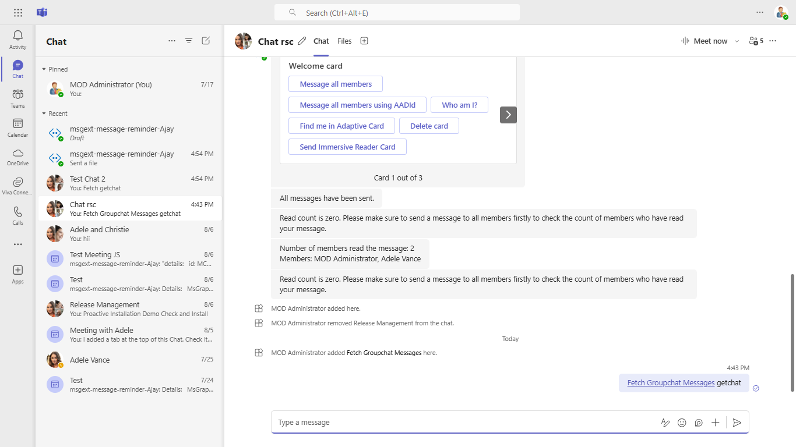

# Archive groupchat messages

Using this C# sample, a bot can archive chat messages of groupchat and send it to user.

This feature shown in this sample is currently available in Public Developer Preview only.

## Key features

- Sending archive chat messages text file of a groupchat to user




## Prerequisites

- [.NET Core SDK](https://dotnet.microsoft.com/download) version 3.1

  ```bash
  # determine dotnet version
  dotnet --version
  ```
- Publicly addressable https url or tunnel such as [ngrok](https://ngrok.com/) or [Tunnel Relay](https://github.com/OfficeDev/microsoft-teams-tunnelrelay) 

## Setup

1 Clone the repository

    ```bash
    git clone https://github.com/OfficeDev/Microsoft-Teams-Samples.git
    ```

2 In a terminal, navigate to `samples/bot-archive-groupchat-messages/csharp`

3 Run ngrok - point to port 3978

```bash
# ngrok http -host-header=rewrite 3978
```

4. Create a Bot Registration
   In Azure portal, create a [Bot Framework registration resource](https://docs.microsoft.com/en-us/azure/bot-service/bot-builder-authentication?view=azure-bot-service-4.0&tabs=csharp%2Caadv2).

   - Ensure that you've [enabled the Teams Channel](https://docs.microsoft.com/en-us/azure/bot-service/channel-connect-teams?view=azure-bot-service-4.0)

   Add this permission to app registration


5. Modify the `manifest.json` in the `/AppManifest` folder and replace the `<<YOUR-MICROSOFT-APP-ID>>` with the id from step 4.

6. Zip the contents of `AppManifest` folder into a `manifest.zip`, and use the `manifest.zip` to deploy in app store or add to Teams.

7. Modify the `/appsettings.json` and fill in the `{{ Bot Id }}`,`{{ Bot Password }}` and `{{ Connection Name }}` with the id from step 4.

8. Upload the manifest.zip to Teams (in the Apps view click "Upload a custom app")
   - Go to Microsoft Teams. From the lower left corner, select Apps
   - From the lower left corner, choose Upload a custom App
   - Go to your project directory, the ./appPackage folder, select the zip folder, and choose Open.
   - Select Add in the pop-up dialog box. Your tab is uploaded to Teams

## To try this sample

- In a terminal, navigate to `FetchGroupChatMessages`

    ```bash
    # change into project folder
    cd # FetchGroupChatMessages
    ```

- Run the bot from a terminal or from Visual Studio, choose option A or B.

  A) From a terminal

  ```bash
  # run the bot
  dotnet run
  ```

  B) Or from Visual Studio

  - Launch Visual Studio
  - File -> Open -> Project/Solution
  - Navigate to `samples/bot-archive-groupchat-messages/csharp` folder
  - Select `FetchGroupChatMessages.csproj` file
  - Press `F5` to run the project

## Interacting with the bot in GroupChat

Select a groupchat and add the bot to chat.

Send `getchat` message to the bot, you will recieve a consent card by the bot in your personal scope.


## Deploy the bot to Azure

To learn more about deploying a bot to Azure, see [Deploy your bot to Azure](https://aka.ms/azuredeployment) for a complete list of deployment instructions.

