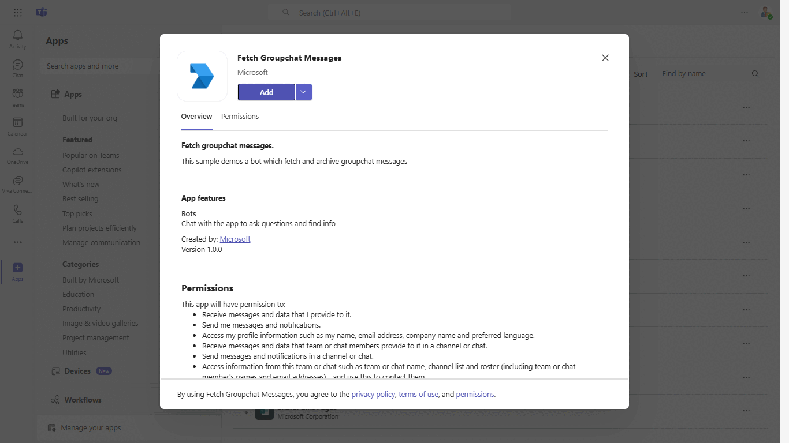
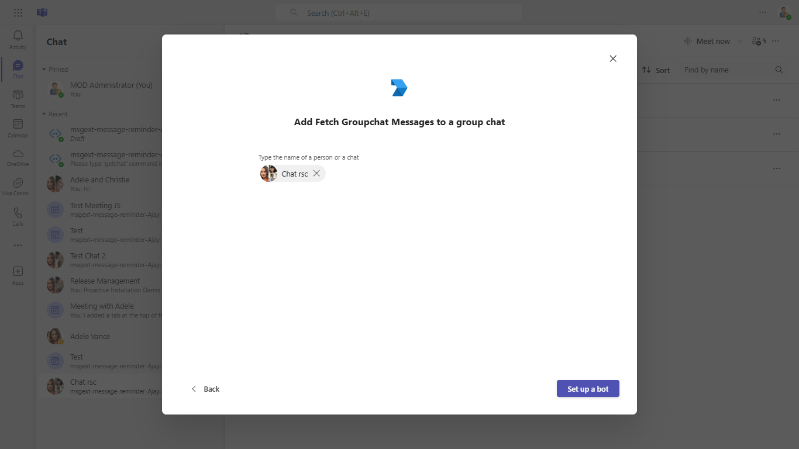
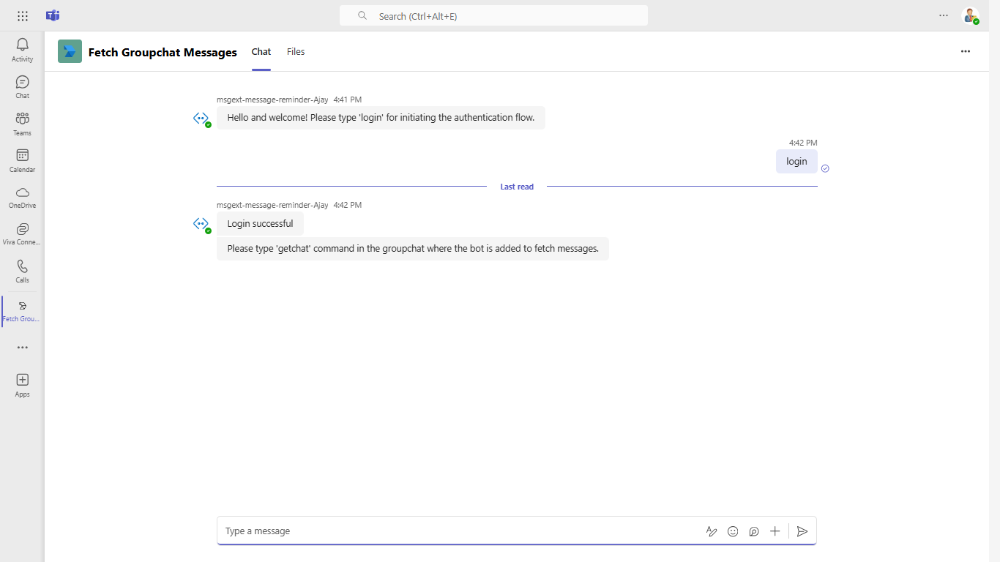
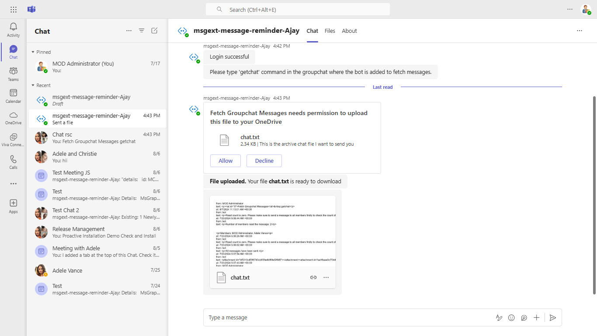

# Archive groupchat messages

Using this C# sample, a bot can archive chat messages of groupchat and send it to user.

This feature shown in this sample is currently available in Public Developer Preview only.

## Included Features
* Teams SSO (Bots)
* Adaptive Cards
* Graph API

## Interaction with app



## Prerequisites

- [.NET Core SDK](https://dotnet.microsoft.com/download) version 6.0

  determine dotnet version
  ```bash
  dotnet --version
  ```
- [Ngrok](https://ngrok.com/download) (For local environment testing) Latest (any other tunneling software can also be used)
  
- [Teams](https://teams.microsoft.com) Microsoft Teams is installed and you have an account

## Setup
1. Register a new application in the [Azure Active Directory – App Registrations](https://go.microsoft.com/fwlink/?linkid=2083908) portal.   
   
    *Enter the following  to Click Expose An API Menu and add a scope details to configure the admin and user consent prompts with values that are appropriate for the access_as_user scope.*
   - Added the WebApplication Info Resource and Application ID URI in expose and API like: api://Ngrokbaseurl/App-id"
   - Admin consent display name: Teams can access the user’s profile.
   - Admin consent description: Teams can call the app’s web APIs as the current user.
   - User consent display name: Teams can access your profile and make requests on your behalf.
   - User consent description: Teams can call this app’s APIs with the same rights as you have.
   
   ### Instruction on setting connection string for bot authentication on the behalf of user

   - In the Azure portal, select your resource group from the dashboard.
   - Select your bot channel registration link.
   - Open the resource page and select Configuration under Settings.
   - Select Add OAuth Connection Settings.
   - Complete the form as follows:

    - **Name:** Enter a name for the connection. You'll use this name in your bot in the appsettings.json file. For example BotTeamsAuthADv1.
    - **Service Provider:** Select Azure Active Directory v2. Once you select this, the Azure AD-specific fields will be displayed.
    - **Client id:** Enter the Application (client) ID .
    - **Client secret:** Enter the Application (client) secret.
    -  Provide **Scopes** like "User.Read Chat.ReadWrite ChatMessage.Read"

   ### Go to the Azure portal where app registration is created and click on API Permissions
 
    - Add this Delegated permission to app registration
    - Chat.ReadWrite
    - ChatMessage.Read
    

   ### Under left menu, select  **Authentication**  under  **Manage**  section
   
    - Select 'Accounts in any organizational directory (Any Azure AD directory - Multitenant)' under Supported account types and click "+Add a platform".
    -  On the flyout menu, Select "Web"    
    -  Add  `https://token.botframework.com/.auth/web/redirect`  under Redirect URLs and click Configure button.
    -  Once the flyout menu close, scroll bottom to section 'Implicit Grant' and select check boxes "Access tokens" and "ID tokens" and click "Save" at the top bar.

2. Setup for Bot
	
	- Also, register a bot with Azure Bot Service, following the instructions [here](https://docs.microsoft.com/en-us/azure/bot-service/bot-service-quickstart-registration?view=azure-bot-service-3.0)
	- Ensure that you've [enabled the Teams Channel](https://docs.microsoft.com/en-us/azure/bot-service/channel-connect-teams?view=azure-bot-service-4.0)
	- While registering the bot, use `https://<your_ngrok_url>/api/messages` as the messaging endpoint.

    > NOTE: When you create your app registration, you will create an App ID and App password - make sure you keep these for later.

3. Setup NGROK
      - Run ngrok - point to port 3978

	```bash
	  ngrok http -host-header=rewrite 3978
	```   
4. Setup for code

  - Clone the repository

    ```bash
    git clone https://github.com/OfficeDev/Microsoft-Teams-Samples.git
    ```
  - Modify the `/appsettings.json` and fill in the following details:
  
  - `{{MICROSOFT-APP-ID}}` - Generated from Step 1 while doing AAd app registration in Azure portal.
  - `{{ MICROSOFT-APP-PASSWORD}}` - Generated from Step 1, also referred to as Client secret
  - `{{ Connection Name }}` - Generated from Step 1, also referred as Instruction on setting connection.
  
  - From a terminal, navigate to `samples/bot-archive-groupchat-messages/csharp`

	  ```bash
	  # run the bot
	  dotnet run
	  ```
	  Or from Visual Studio
	     - Launch Visual Studio
	     - File -> Open -> Project/Solution
	     - Navigate to `bot-archive-groupchat-messages/csharp` folder
	     - Select `FetchGroupChatMessages.sln` file
	     - Press `F5` to run the project
      
 5. Setup Manifest for Teams
	- __*This step is specific to Teams.*__
	    - **Edit** the `manifest.json` contained in the ./AppManifest folder to replace your Microsoft App Id (that was created when you registered your app registration earlier) *everywhere* you see the place holder string `{{Microsoft-App-Id}}` (depending on the scenario the Microsoft App Id may occur multiple times in the `manifest.json`)
	    - **Edit** the `manifest.json` for `validDomains` and replace `{{domain-name}}` with base Url of your domain. E.g. if you are using ngrok it would be `https://1234.ngrok.io` then your domain-name will be `1234.ngrok.io`.
      - **Edit** the `manifest.json` for `"webApplicationInfo"` resource  `"api://botid-<<MICROSOFT-APP-ID>>"` with base Url of your domain. E.g. if you are using ngrok it would be `https://1234.ngrok.io` then your resource will be `api://botid-<<MICROSOFT-APP-ID>>`.
     
	    - **Zip** up the contents of the `manifest` folder to create a `manifest.zip` (Make sure that zip file does not contains any subfolder otherwise you will get error while uploading your .zip package)

	- Upload the manifest.zip to Teams (in the Apps view click "Upload a custom app")
	   - Go to Microsoft Teams. From the lower left corner, select Apps
	   - From the lower left corner, choose Upload a custom App
	   - Go to your project directory, the ./manifest folder, select the zip folder, and choose Open.
	   - Select Add in the pop-up dialog box. Your app is uploaded to Teams.

**Note**: If you are facing any issue in your app, please uncomment [this](https://github.com/OfficeDev/Microsoft-Teams-Samples/blob/main/samples/bot-archive-groupchat-messages/csharp/FetchGroupChatMessages/AdapterWithErrorHandler.cs#L23) line and put your debugger for local debug.
    
## Running the Sample

- Sending archive chat messages text file of a groupchat to user








## Interacting with the bot in GroupChat

Select a groupchat and add the bot to chat.

Send `getchat` message to the bot, you will recieve a consent card by the bot in your personal scope.

## Deploy the bot to Azure

To learn more about deploying a bot to Azure, see [Deploy your bot to Azure](https://aka.ms/azuredeployment) for a complete list of deployment instructions.

