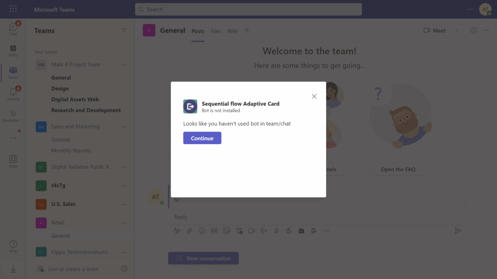
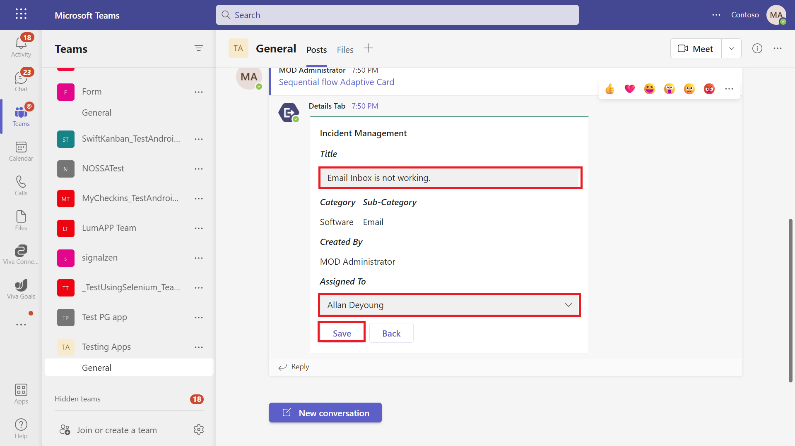
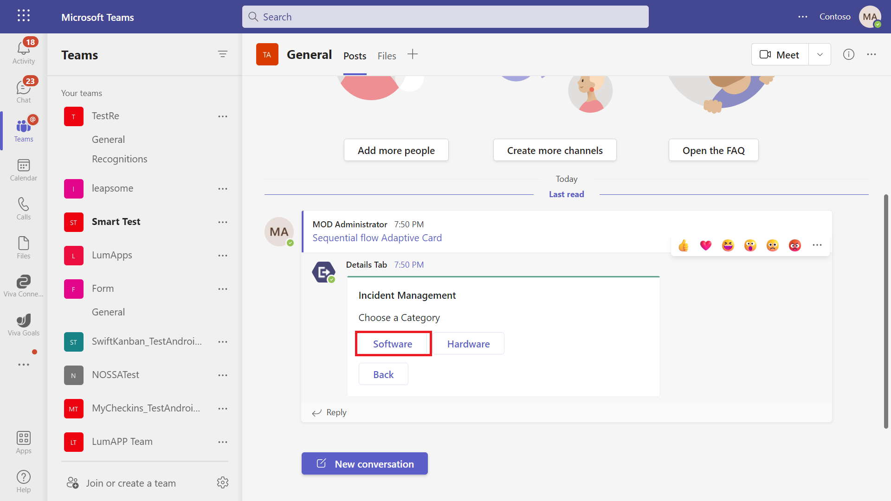
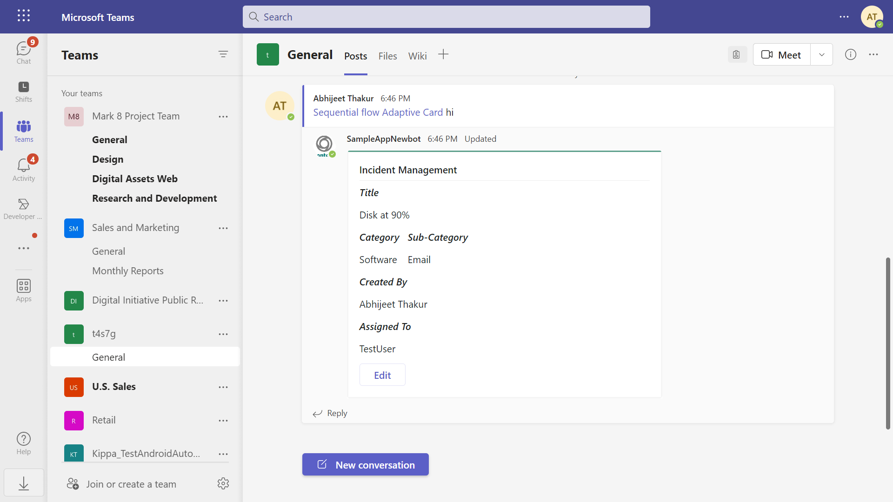

# Sequential workflow adaptive cards C#

This sample illustrates sequential workflow, user specific views and upto date adaptive cards bot and the list of incident created can be seen in messaging extension and can share a specific incident to the chat/team.

## Interaction with app


## Prerequisites

- Microsoft Teams is installed and you have an account
- [.NET Core SDK](https://dotnet.microsoft.com/download) version 6.0
- [ngrok](https://ngrok.com/download) or equivalent tunnelling solution

## Setup

1. Register a new application in the [Azure Active Directory – App Registrations](https://go.microsoft.com/fwlink/?linkid=2083908) portal.

2. Setup for Bot
	- Register a AAD aap registration in Azure portal.
	- Also, register a bot with Azure Bot Service, following the instructions [here](https://docs.microsoft.com/en-us/azure/bot-service/bot-service-quickstart-registration?view=azure-bot-service-3.0).
	- Ensure that you've [enabled the Teams Channel](https://docs.microsoft.com/en-us/azure/bot-service/channel-connect-teams?view=azure-bot-service-4.0)
	- While registering the bot, use `https://<your_ngrok_url>/api/messages` as the messaging endpoint.

    > NOTE: When you create your app registration, you will create an App ID and App password - make sure you keep these for later.

3. Setup NGROK
      - Run ngrok - point to port 3978

	```bash
	# ngrok http -host-header=rewrite 3978
	```   
4. Setup for code

  - Clone the repository
    ```bash
    git clone https://github.com/OfficeDev/Microsoft-Teams-Samples.git
    ```
   - Modify the `/appsettings.json` and fill in the following details:
     - `{{YOUR-MICROSOFT-APP-ID}}` - Generated from Step 1 is the application app id
     - `{{YOUR-MICROSOFT-APP-SECRET}}` - Generated from Step 1, also referred to as Client secret
     
  - If you are using Visual Studio
  - Launch Visual Studio
  - File -> Open -> Project/Solution
  - Navigate to `samples/bot-sequential-flow-adaptive-cards/csharp/` folder
  - Select `SequentialUserSpecificFlow.csproj` file
  - Run your app, either from Visual Studio with `F5` or using `dotnet run` in the appropriate folder.
  

5. Setup Manifest for Teams
  - __*This step is specific to Teams.*__
    - **Edit** the `manifest.json` contained in the ./Manifest folder to replace your Microsoft App Id (that was created when you registered your app registration earlier) *everywhere* you see the place holder string `{{Microsoft-App-Id}}` (depending on the scenario the Microsoft App Id may occur multiple times in the `manifest.json`)
     - **Edit** the `manifest.json` for `validDomains` and replace `{{domain-name}}` with base Url of your domain. E.g. if you are using ngrok it would be `https://1234.ngrok.io` then your domain-name will be `1234.ngrok.io`.
     - **Zip** up the contents of the `Manifest` folder to create a `manifest.zip` (Make sure that zip file does not contains any subfolder otherwise you will get error while uploading your .zip package)

 - Upload the manifest.zip to Teams (in the Apps view click "Upload a custom app")
    - Go to Microsoft Teams. From the lower left corner, select Apps
    - From the lower left corner, choose Upload a custom App
    - Go to your project directory, the ./Manifest folder, select the zip folder, and choose Open.
    - Select Add in the pop-up dialog box. Your app is uploaded to Teams.

Note:- If you are facing any issue in your app,  [please uncomment this line](https://github.com/OfficeDev/Microsoft-Teams-Samples/blob/main/samples/bot-sequential-flow-adaptive-cards/csharp/SequentialUserSpecificFlow/AdapterWithErrorHandler.cs#L25) and put your debugger for local debug.

## Workflows

### Workflow for bot interaction

```mermaid
sequenceDiagram
    participant Teams User B    
    participant Teams User A
    participant Teams Client
    Teams User A->>+Teams Client: Enters create incident bot commands
    Sample App->>+Teams Client: loads card with option 
    Teams User A->>+Teams Client: Enters required details and assigns to user B
    Sample App-->>Teams Client: Posts the incidet card with auto-refresh for user A and user B
    Teams Client->>Teams User A: loads incident card with loading indicator 
    Teams Client->>Sample App: Automatically invokes refresh action
    Sample App-->>Teams User A: Responds with Updated AC for the user A
    Teams User B->>Teams Client: User opens the chat
    Teams Client-->>Teams User B: Loads the incident base card
    Teams Client->>Sample App: Automatically invokes refresh action
    Sample App-->>Teams User B: Responds with card for user B with option to approve/reject
```

### Workflow for messaging extension interaction


```mermaid
sequenceDiagram
    participant Teams User B    
    participant Teams User A
    participant Teams Client
    Teams User A->>+Teams Client: Clicks on Incidents ME action in a group chat
    opt App not installed flow
        Teams Client-->>Teams User A: App install dialog
        Teams User A->>Teams Client: Installs app
    end   
    Teams Client->>+Sample App: Launches Task Module
    Sample App-->>-Teams Client: Loads existing incidents created using Bot
    Teams User A->>Teams Client: Selects incident to share in chat
    Teams Client->>Sample App: Invoke action callback composeExtension/submitAction
    Sample App-->>Teams Client: Posts Base card with auto-refresh for user A and user B
    Teams Client->>Teams User A: loads incident card with loading indicator 
    Teams Client->>Sample App: Automatically invokes refresh action
    Sample App-->>Teams User A: Responds with Updated AC for the user A
    Teams User B->>Teams Client: User opens the chat
    Teams Client-->>Teams User B: Loads the incident base card
    Teams Client->>Sample App: Automatically invokes refresh action
    Sample App-->>Teams User B: Responds with card for user B with option to approve/reject
```


## Running the sample

1. In Teams, Once the app is successfully installed in a group chat, ping the bot by @mentioning it. Bot will reply with a card showing that the person has initiated the incident. 

  
  
2. Using refresh activity only the person who has initiated will be able to proceed further by entering the details of the incident and assign it to a person from the group chat, while others in the group chat will still be able to see only the initiated card.

  

3. User who has initiated the incident will be able to enter the details using the series of cards in a sequential flow and submit it for the further approval/rejection process.

  
  
  
  
4. Once the details are submitted and assigned to a person from the group chat, it will send an updated card to the chat with all the entered details.

  
  
5. Now, only the person assigned to will be able to either approve or reject it.

    

6. After the approval/rejection of the card, the final updated card will be sent to the group chat.

  


## Running the sample( Interaction with message extension)


1. On selecting app from messaging extension,it checks whether bot is installed in chat/team. If not installed, user will get a option for justInTimeInstallation card.

   

2. After successful installation, list of all incident will be available in messaging extension.

   .
   
3. User can select any incident from the list and can share to that chat/team.

   .   

## Further Reading
   [Bot-Sequential-flow-adaptive-card](https://learn.microsoft.com/en-us/power-automate/create-adaptive-cards)

