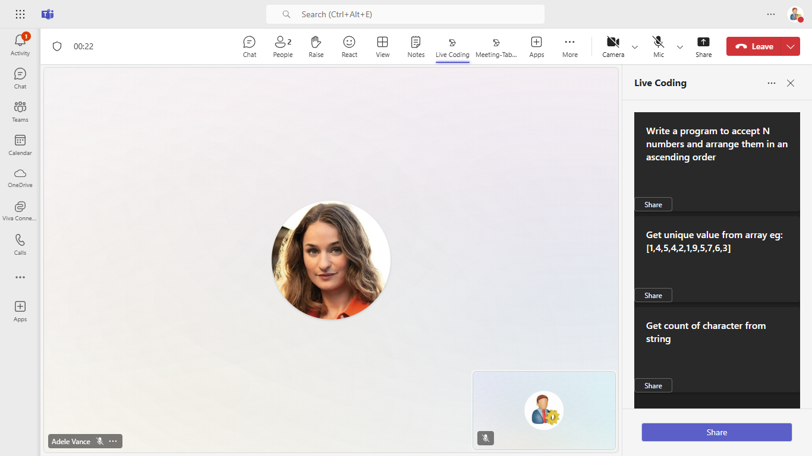
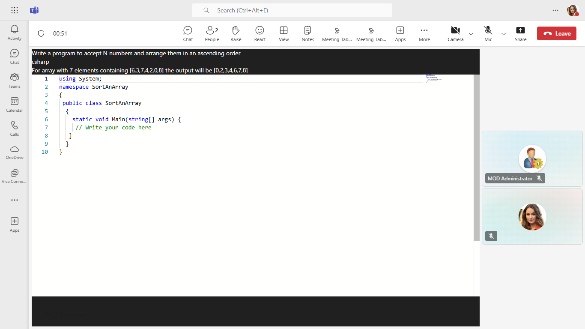

# Live coding interview using Shared meeting stage 

This sample demos a live coding in a Teams meeting stage using [Live Share SDK](https://aka.ms/livesharedocs). In side panel there is a list of question in specific coding language and on share click specific question with language code editor will be shared with other participant in meeting.
Now any participant in meeting can write code for the question and same will be updated to all the other participants in meeting.

## Included Features
* Meeting Stage
* Meeting SidePanel
* Live Share SDK
* RSC Permissions

## Interaction with app


## Try it yourself - experience the App in your Microsoft Teams client
Please find below demo manifest which is deployed on Microsoft Azure and you can try it yourself by uploading the app package (.zip file link below) to your teams and/or as a personal app. (Sideloading must be enabled for your tenant, [see steps here](https://docs.microsoft.com/microsoftteams/platform/concepts/build-and-test/prepare-your-o365-tenant#enable-custom-teams-apps-and-turn-on-custom-app-uploading)).

**Live coding interview using Shared meeting stage:** [Manifest](/samples/meetings-live-code-interview/csharp/demo-manifest/meetings-live-code-interview.zip)

## Prerequisites

 - Office 365 tenant. You can get a free tenant for development use by signing up for the [Office 365 Developer Program](https://developer.microsoft.com/en-us/microsoft-365/dev-program).

- To test locally, [NodeJS](https://nodejs.org/en/download/) must be installed on your development machine (version 16.14.2  or higher).

- [dev tunnel](https://learn.microsoft.com/en-us/azure/developer/dev-tunnels/get-started?tabs=windows) or [ngrok](https://ngrok.com/) latest version or equivalent tunnelling solution

- [Teams Toolkit for VS Code](https://marketplace.visualstudio.com/items?itemName=TeamsDevApp.ms-teams-vscode-extension) or [TeamsFx CLI](https://learn.microsoft.com/microsoftteams/platform/toolkit/teamsfx-cli?pivots=version-one)

## Run the app (Using Teams Toolkit for Visual Studio Code)

The simplest way to run this sample in Teams is to use Teams Toolkit for Visual Studio Code.

1. Ensure you have downloaded and installed [Visual Studio Code](https://code.visualstudio.com/docs/setup/setup-overview)
1. Install the [Teams Toolkit extension](https://marketplace.visualstudio.com/items?itemName=TeamsDevApp.ms-teams-vscode-extension)
1. Select **File > Open Folder** in VS Code and choose this samples directory from the repo
1. Using the extension, sign in with your Microsoft 365 account where you have permissions to upload custom apps
1. Select **Debug > Start Debugging** or **F5** to run the app in a Teams web client.
1. In the browser that launches, select the **Add** button to install the app to Teams.

> If you do not have permission to upload custom apps (sideloading), Teams Toolkit will recommend creating and using a Microsoft 365 Developer Program account - a free program to get your own dev environment sandbox that includes Teams.

## Workflow

```mermaid

sequenceDiagram

    Teams User->>+Teams Client: Schedules a Teams Meeting with candidate

    Teams Client->>+Live Coding App: Installs the App

    Teams User->>+Teams Client: Starts the meeting

    Teams User->>+Live Coding App: Opens the Live coding app side panel

    Live Coding App->>+Side Panel: Load questions

    Side Panel-->>-Live Coding App: Loads predefined coding questions

    Teams User->>+Side Panel: Select the coding question to share to stage

    Side Panel-->>-Teams Client: Tells the team client to open a code editor on the stage

    Teams Client->>+Code Editor Stage: Tells the app which coding question to open

    Code Editor Stage-->>-Live Coding App: Shares the question to share to stage in the meeting

```

## Setup

 1. Register a new application in the [Microsoft Entra ID – App Registrations](https://go.microsoft.com/fwlink/?linkid=2083908) portal.
 
    - Your app must be registered in the Azure AD portal to integrate with the Microsoft identity platform and call Microsoft Graph APIs. See [Register an application with the Microsoft identity platform](https://docs.microsoft.com/graph/auth-register-app-v2).
    - You need to add following permissions mentioned in the below screenshots to call respective Graph   API
 

**NOTE:** When you create app registration, you will create an App ID and App password - make sure you keep these for later.


2. Setup NGROK
 - Run ngrok - point to port 3978

   ```bash
   ngrok http 3978 --host-header="localhost:3978"
   ```  

   Alternatively, you can also use the `dev tunnels`. Please follow [Create and host a dev tunnel](https://learn.microsoft.com/en-us/azure/developer/dev-tunnels/get-started?tabs=windows) and host the tunnel with anonymous user access command as shown below:

   ```bash
   devtunnel host -p 3978 --allow-anonymous
   ```

3. Setup for code

  - Clone the repository

    ```bash
    git clone https://github.com/OfficeDev/Microsoft-Teams-Samples.git
    ```
  
  Install node modules

   Inside node js folder,  navigate to `samples/meetings-live-code-interview/nodejs/api` open your local terminal and run the below command to install node modules. You can do the same in Visual Studio code terminal by opening the project in Visual Studio code.

   - Repeat the same step in folder `samples/meetings-live-code-interview/nodejs`

    ```bash
    npm install
    ```
  - We have two different solutions to run so follow below steps:

     A) In a terminal, navigate to `samples/meetings-live-code-interview/nodejs/api`

     B) In a different terminal, navigate to `samples/meetings-live-code-interview/nodejs`

 - Run both solutions i.e. `samples/meetings-live-code-interview/nodejs/api` and `samples/meetings-live-code-interview/nodejs`
    ```
    npm start
    ``` 

4. Setup Manifest for Teams
- __*This step is specific to Teams.*__
    - **Edit** the `manifest.json` contained in the ./appManifest folder to replace your Microsoft App Id (that was created when you registered your app registration earlier) *everywhere* you see the place holder string `{{Microsoft-App-Id}}` (depending on the scenario the Microsoft App Id may occur multiple times in the `manifest.json`)
    - **Edit** the `manifest.json` for `validDomains` and replace `{{domain-name}}` with base Url of your domain. E.g. if you are using ngrok it would be `https://1234.ngrok-free.app` then your domain-name will be `1234.ngrok-free.app` and if you are using dev tunnels then your domain will be like: `12345.devtunnels.ms`.
    - **Zip** up the contents of the `appManifest` folder to create a `manifest.zip` (Make sure that zip file does not contains any subfolder otherwise you will get error while uploading your .zip package)

- Upload the manifest.zip to Teams (in the Apps view click "Upload a custom app")
   - Go to Microsoft Teams. From the lower left corner, select Apps
   - From the lower left corner, choose Upload a custom App
   - Go to your project directory, the ./appManifest folder, select the zip folder, and choose Open.
   - Select Add in the pop-up dialog box. Your app is uploaded to Teams.

**Note** Run the app on Teams with developer preview on.   

## Running the sample

**Side panel view:**


**Question view on click of share:**


**Question view for other participant in meeting:**


## Further reading

- [Share-app-content-to-stage-api ](https://docs.microsoft.com/en-us/microsoftteams/platform/apps-in-teams-meetings/api-references?tabs=dotnet#share-app-content-to-stage-api)
- [Enable-and-configure-your-app-for-teams-meetings](https://docs.microsoft.com/en-us/microsoftteams/platform/apps-in-teams-meetings/enable-and-configure-your-app-for-teams-meetings)
- [Live-share-sdk-overview](https://docs.microsoft.com/en-us/microsoftteams/platform/apps-in-teams-meetings/teams-live-share-overview)

