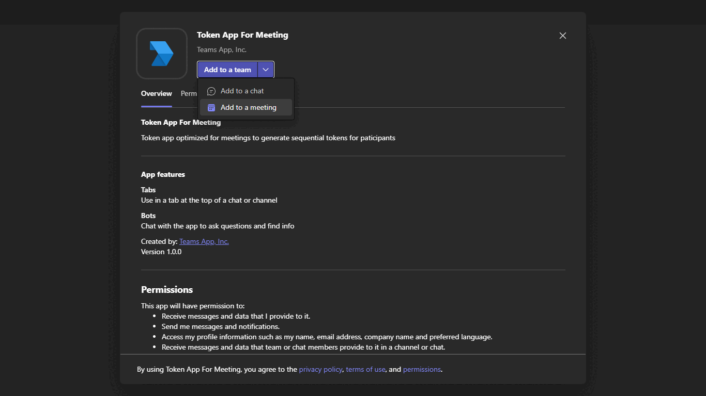
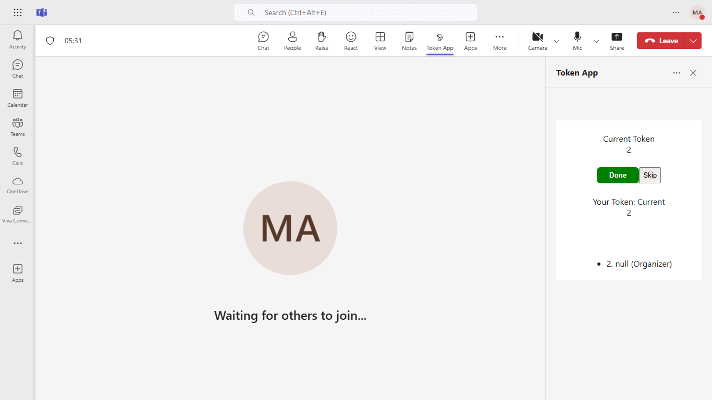
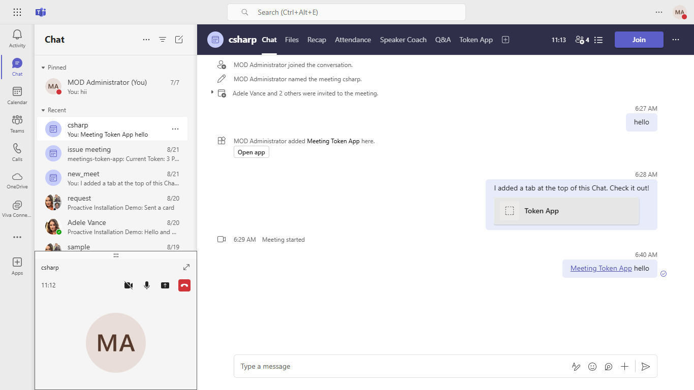
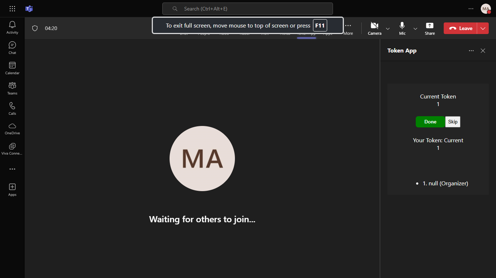
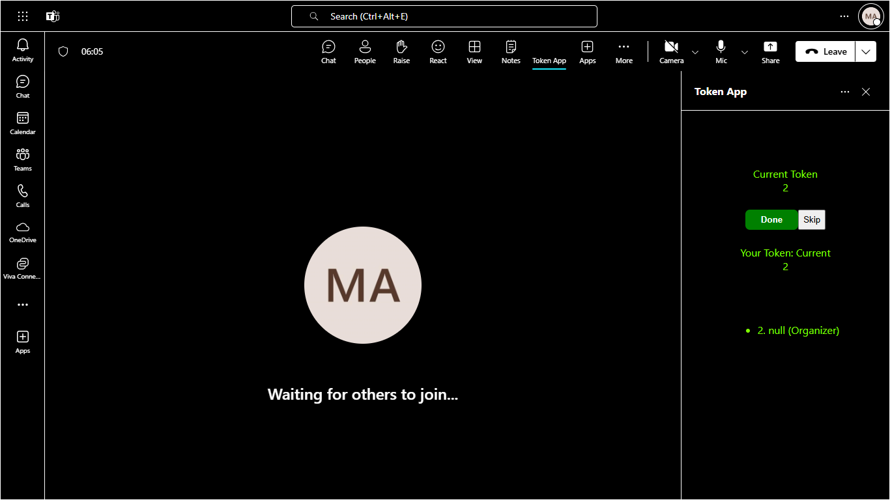

# Meeting Token Generator

The Meeting Token Generator app is a sample Microsoft Teams app that extends meetings in Teams.
Through this app, meeting participants can request a "token", which is generated sequentially so that each participant has a fair opportunity to interact. This can be useful in situations like scrum meetings, Q&A sessions, etc.
This application also shows the implementation of Live Share SDK to update the data in real-time for all participants in meeting.

- [Live-share-sdk-overview](https://docs.microsoft.com/microsoftteams/platform/apps-in-teams-meetings/teams-live-share-overview)
- [Build tabs for meeting](https://learn.microsoft.com/microsoftteams/platform/apps-in-teams-meetings/build-tabs-for-meeting?tabs=desktop)

## Included Features
* Meeting Chat
* Meeting Details
* Meeting SidePanel
* Live Share SDK
* RSC Permissions
* Theme Handler

**NOTE: This capability is currently available in developer preview only.**

## Interaction with app
 


## Interaction with app theme




## Try it yourself - experience the App in your Microsoft Teams client
Please find below demo manifest which is deployed on Microsoft Azure and you can try it yourself by uploading the app manifest (.zip file link below) to your teams and/or as a personal app. (Sideloading must be enabled for your tenant, [see steps here](https://docs.microsoft.com/microsoftteams/platform/concepts/build-and-test/prepare-your-o365-tenant#enable-custom-teams-apps-and-turn-on-custom-app-uploading)).

**Meetings Token App:** [Manifest](/samples/meetings-token-app/csharp/demo-manifest/meetings-token-app.zip)

## Prerequisites

- [.NET Core SDK](https://dotnet.microsoft.com/download) version 6.0

  determine dotnet version
  ```bash
  dotnet --version
  ```
- [dev tunnel](https://learn.microsoft.com/en-us/azure/developer/dev-tunnels/get-started?tabs=windows) or [Ngrok](https://ngrok.com/download) (For local environment testing) latest version (any other tunneling software can also be used)
  
- [Teams](https://teams.microsoft.com) Microsoft Teams is installed and you have an account

### Technologies

We assume working knowledge of the following technologies to gain full understanding of the app
- [C#](https://docs.microsoft.com/dotnet/csharp/tutorials/)
- [ECMAScript6](http://es6-features.org/)
- [Asp.NET core](https://docs.microsoft.com/aspnet/core/?view=aspnetcore-3.1) version 3.1
- [React.JS](https://reactjs.org/tutorial/tutorial.html) version 16+ 

The app uses the Teams extensibility features described on the following pages:
- [Apps in Teams meetings](https://docs.microsoft.com/microsoftteams/platform/apps-in-teams-meetings/teams-apps-in-meetings)
- [Create apps for Teams meetings](https://docs.microsoft.com/microsoftteams/platform/apps-in-teams-meetings/create-apps-for-teams-meetings?tabs=json)
- [Tab single sign-on](https://docs.microsoft.com/microsoftteams/platform/tabs/how-to/authentication/auth-aad-sso) to get the identity of the user accessing the tab, in a way that can be verified in the server APIs

## Setup
**This app will work in developer preview only**

1. Register a new application in the [Azure Active Directory   App Registrations](https://go.microsoft.com/fwlink/?linkid=2083908) portal.

2. Setup for Bot
  - Register a AAD aap registration in Azure portal.
  - Also, register a bot with Azure Bot Service, following the instructions [here](https://docs.microsoft.com/azure/bot-service/bot-service-quickstart-registration?view=azure-bot-service-3.0).
  - Ensure that you've [enabled the Teams Channel](https://docs.microsoft.com/azure/bot-service/channel-connect-teams?view=azure-bot-service-4.0)
  - While registering the bot, use `https://<your_tunnel_domain>/api/messages` as the messaging endpoint.

    > NOTE: When you create your app registration, you will create an App ID and App password - make sure you keep these for later.

3. Setup NGROK
- Run ngrok - point to port 3978

```bash
# ngrok http 3978 --host-header="localhost:3978"
```

4. Setup for code

- Clone the repository

    ```bash
    git clone https://github.com/OfficeDev/Microsoft-Teams-Samples.git
    ```
- Set up the appsettings.json with the following keys:
    - `"MicrosoftAppId"`: Application (client) ID of the bot's Azure AD application
    - `"MicrosoftAppPassword"`: client secret of the bot's Azure AD application
    - `"AzureAd"."TenantId"`: Tenant ID of the tenant where the app will be used. Note that the sample will only work in this tenant.
    - `"AzureAd"."ApplicationIdURI "`: Set to the same value as `api://[WebAppDomain]/MicrosoftAppId`.
    - `"ContentBubbleUrl "`: Content bubble iframe url (default. `https://[WebAppDomain]/contentBubble.html`). Remember that `[WebAppDomain]` will be your tunnel domain, so the content bubble URL will be similar to `https://f631****.ngrok-free.app/contentBubble.html`.
 
 - Build and run the service
      You can build and run the project from the command line or an IDE:

      A) From a command line:
      
        ```bash
        # run the server
        cd TokenApp
        dotnet run
        ```

      B) From an IDE:
      1. Launch Visual Studio
      2. File > Open > Project/Solution
      3. Navigate to the `TokenApp` folder
      4. Select `TokenApp.csproj` file
      5. Press `F5` to run the project

      1. Set `manifestVersion` to "devPreview"
      1. Add your bot configuration, with the app id of the bot generated from the previous steps
      1. Fill-in the following `webApplicationInfo` section, using `MicrosoftAppId` and `WebAppDomain` values from the previous section.
          
          ```json
          "webApplicationInfo": {  
            "id": "[MicrosoftAppId]",  
            "resource": "api://[WebAppDomainName]/[MicrosoftAppId]"  
          }
        ``` 
5. Setup Manifest for Teams
- __*This step is specific to Teams.*__
    - **Edit** the `manifest.json` contained in the ./AppManifest folder to replace your Microsoft App Id (that was created when you registered your app registration earlier) *everywhere* you see the place holder string `{{Microsoft-App-Id}}` (depending on the scenario the Microsoft App Id may occur multiple times in the `manifest.json`)
    - **Edit** the `manifest.json` for `validDomains` and replace `{{domain-name}}` with base Url of your domain. E.g. if you are using ngrok it would be `https://1234.ngrok-free.app` then your domain-name will be `1234.ngrok-free.app` and if you are using dev tunnels then your domain will be like: `12345.devtunnels.ms`.
    - **Zip** up the contents of the `AppManifest` folder to create a `manifest.zip` (Make sure that zip file does not contains any subfolder otherwise you will get error while uploading your .zip package)

- Upload the manifest.zip to Teams (in the Apps view click "Upload a custom app")
   - Go to Microsoft Teams. From the lower left corner, select Apps
   - From the lower left corner, choose Upload a custom App
   - Go to your project directory, the ./AppManifest folder, select the zip folder, and choose Open.
   - Select Add in the pop-up dialog box. Your app is uploaded to Teams.
   
- Enable developer preview in your desktop Teams client
Follow [these instructions](https://docs.microsoft.com/microsoftteams/platform/resources/dev-preview/developer-preview-intro#enable-developer-preview) to enable developer preview. Note that Developer preview mode must be enabled on each Teams client app or browser.

Note: Open the meeting chat section and type @MeetingTokenApp Hello (It will send back the required information to you).

> In-meeting tabs are only available in the Teams desktop client. They will not be visible when you run Teams in a web browser.

**Note**: If you are facing any issue in your app, please uncomment [this](https://github.com/OfficeDev/Microsoft-Teams-Samples/blob/main/samples/meetings-token-app/csharp/AdapterWithErrorHandler.cs#L32) line and put your debugger for local debug.
  
-- Sideload the app in a Teams desktop client
    1. Create a meeting with few test participants, ideally with a mix of Presenters and Attendees.
    1. Once meeting is created, go to the meeting details page and click on the "Add tab" (+) button.
    1. In the pop-up that opens, click on "Manage apps".
    1. Click on "Upload a custom app" and upload the .zip file that was created in the previous steps. This adds the app to the meeting.
    1. Click on the "Add tab" button again. Now in the app selection page, the app should be visible as a "Meeting optimized tab".
    1. Select the Meeting Token app.
    1. Now the app will be visible in the meeting chat.
    1. Start the meeting and the icon should be visible in the meeting control bar.

## Running the sample
 - Display the current token that is being serviced in the meeting
 - Display the user list sorted by the token number in ascending order
 - Generate a token for the user upon request
 - Display the current user's token number
 - Mark a token as done by the user
 - Skip the current token for the organizer of the meeting

 

 

 

 

 ### Interactions with app theme
 

 

 
  
### User interactions
- **Token** - Requests a token for the user
- **Done** - Acknowledges that the user is done with the token
- **Skip** - Skips the current user and moves on to the next person in line for a token. This button is only shown to users with the meeting Organizer role.

## Troubleshooting
The sample app uses an in-memory store to maintain token information and the service URL for the tenant. If you restart the project, you must run the following command to recapture the service URL: `@[BotName] reset`

In your own projects, please use a durable storage mechanism to store the service URL for the tenant.

## Further reading

- [Meeting apps APIs](https://learn.microsoft.com/microsoftteams/platform/apps-in-teams-meetings/meeting-apps-apis?tabs=dotnet)
- [Build tabs for meeting](https://learn.microsoft.com/microsoftteams/platform/apps-in-teams-meetings/build-tabs-for-meeting?tabs=desktop)
- [Teams Tabs experience](https://docs.microsoft.com/microsoftteams/platform/tabs/what-are-tabs)
- [Tabs SSO](https://docs.microsoft.com/microsoftteams/platform/tabs/how-to/authentication/auth-aad-sso)
- [Azure Bot Service Introduction](https://docs.microsoft.com/azure/bot-service/bot-service-overview-introduction?view=azure-bot-service-4.0)
- [Azure Bot Service Documentation](https://docs.microsoft.com/azure/bot-service/?view=azure-bot-service-4.0)
- [Azure Portal](https://portal.azure.com)
- [Handle theme change](https://learn.microsoft.com/en-us/microsoftteams/platform/tabs/how-to/access-teams-context?tabs=Json-v2%2Cteamsjs-v2%2Cdefault#handle-theme-change)

# Contributing

This project welcomes contributions and suggestions.  Most contributions require you to agree to a
Contributor License Agreement (CLA) declaring that you have the right to, and actually do, grant us
the rights to use your contribution. For details, visit https://cla.opensource.microsoft.com.

When you submit a pull request, a CLA bot will automatically determine whether you need to provide
a CLA and decorate the PR appropriately (e.g., status check, comment). Simply follow the instructions
provided by the bot. You will only need to do this once across all repos using our CLA.

This project has adopted the [Microsoft Open Source Code of Conduct](https://opensource.microsoft.com/codeofconduct/).
For more information see the [Code of Conduct FAQ](https://opensource.microsoft.com/codeofconduct/faq/) or
contact [opencode@microsoft.com](mailto:opencode@microsoft.com) with any additional questions or comments.

