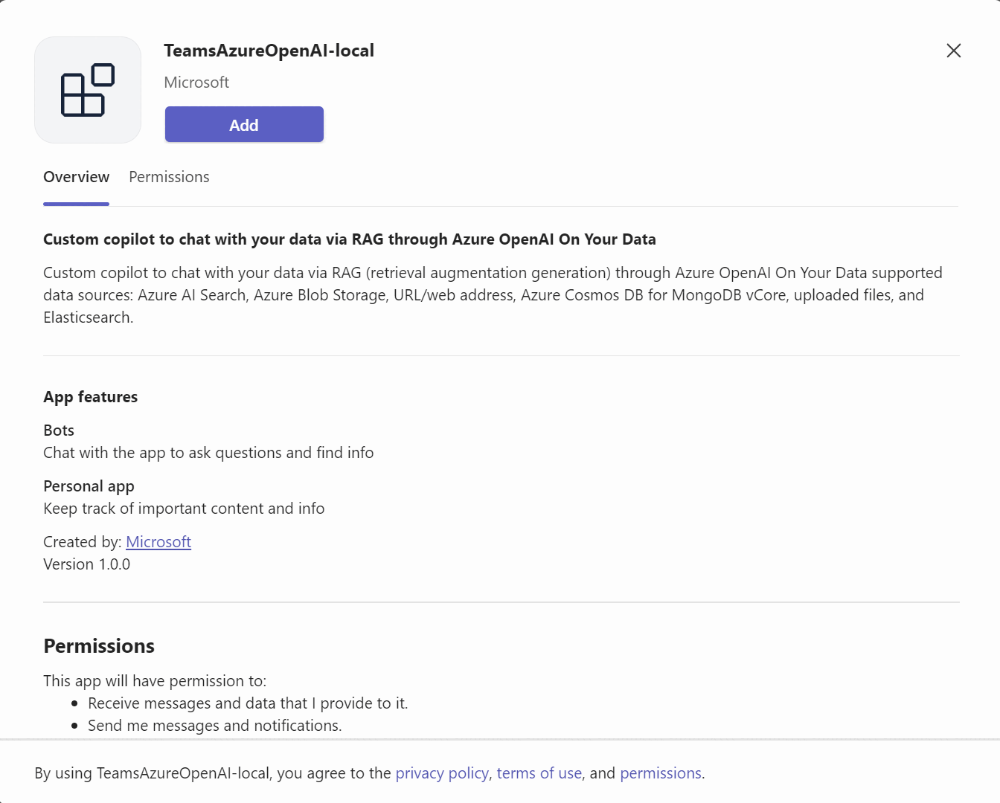
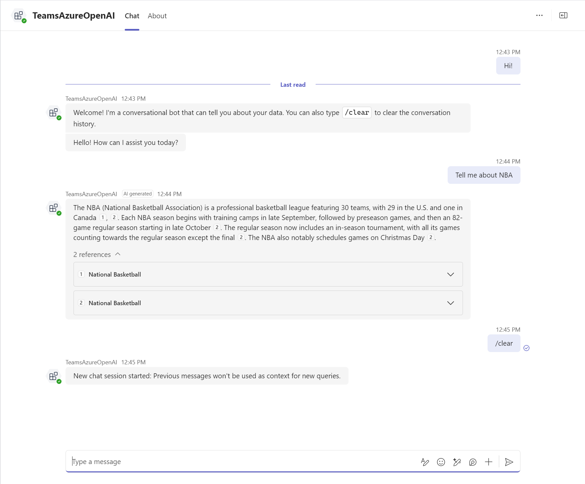

# Chat With Your Data
[](https://github.com/codespaces/new?hide_repo_select=true&ref=mbindra-ChatWithYourData&repo=322043759&devcontainer_path=.devcontainer%2Fmsteams-chat-with-your-data%2Fdevcontainer.json&resume=1)

This sample showcases a Teams app template to chat with your data via RAG (retrieval augmentation generation) through Azure OpenAI On Your Data and Azure AI Search.
- The user can set up a datasource such as Azure AI Search, Azure Blob Storage, URL/web address, Azure Cosmos DB for MongoDB vCore, uploaded files, or Elasticsearch.
- The user can then interact with the data through the Teams app template.

## Included Features
* **Azure Open AI:** Azure OpenAI On Your Data leverages OpenAI's language models, like GPT-3.5 and GPT-4, augmented with RAG to provide a conversational interface for interacting with your domain data using the chat completions API.
* **Azure AI Search:** Azure AI  Search is utilized as a data source for Azure OpenAI's chat completions API.
* **Azure Blob Storage:** The uploaded files are stored in a container in Azure Blob Storage and indexed by Azure AI Search.

## Interaction with the app
 
  
## Set up and run the app in Github Codespaces
1. Click Open in GitHub Codespaces badge above to create a codespace for the sample app. Wait for the codespace to be setup, it may take a couple of minutes.
2. Using the Teams Toolkit extension, sign in to your Microsoft 365 account and Azure account under ```ACCOUNTS```.
3. [Set up your data source using Azure AI resources](#set-up-your-data-source).
4. [Populate the environment files](#populate-the-environment-files).
5. Press **Ctrl+Shift+D** to open the ```Run and Debug``` menu. Select ```Debug``` and press ```F5``` or click on the play button.
6. Download the zip file ```appPackage/build/appPackage.local.zip``` and [sideload the app to Teams](#sideload-the-app-to-teams).
7. You can now [interact with the app](#interact-with-the-app).

## Set up and run the app locally
### Prerequisites
- [Python 3.11](https://www.python.org/downloads/)
- [Node.js](https://nodejs.org/)
- [Rust](https://www.rust-lang.org/tools/install)
- [Poetry](https://python-poetry.org/docs/#installation)
- [Azure CLI](https://learn.microsoft.com/en-us/cli/azure/install-azure-cli)
- [Visual Studio Code](https://code.visualstudio.com/download)
- [Teams Toolkit Extension ](https://marketplace.visualstudio.com/items?itemName=TeamsDevApp.ms-teams-vscode-extension)
- [Python Extension](https://marketplace.visualstudio.com/items?itemName=ms-python.python)
  
1. Clone the repository
   ```git clone https://github.com/t-mbindra/chat-with-your-data.git```
2. Open the project folder(Microsoft-Teams-Samples/samples/msteams-chat-with-your-data) in VS Code.
3.  Run
   ```poetry install && poetry build``` in the terminal.
4. Using the Teams Toolkit extension, sign in to your Microsoft 365 account and Azure account under ```ACCOUNTS```.
5. [Set up your data source using Azure AI resources](#set-up-your-data-source).
6. [Populate the environment files](#populate-the-environment-files).
7. Press **Ctrl+Shift+D** to open the ```Run and Debug``` menu. Press ```F5``` or click on the play button.
8. You can now [interact with the app](#interact-with-the-app).

>[!Note]
> Check the status of all your local(Debug/F5 flow) bots on [Microsoft Bot Framework](https://dev.botframework.com/bots).
> Check the status of all your Teams apps on [Teams Developer Portal](https://dev.teams.microsoft.com/apps).
> Teams toolkit will also generate an app registration along with a password which can be seen under **App Registrations** on the Azure portal.

## Set up your data source
1. Run```sh deploy.sh``` in the terminal. You can use Azure Cloud Shell (Bash) for a Windows device. You will be prompted to login to Azure and select a subscription.
2. Go to the [Azure AI Studio](https://oai.azure.com/portal), select relevant subscription and the resource ```teamsazureopenai-cognitive```.
3.  Proceed to the ```Chat Playground```.  Click on ```Add a data source``` under the ```Add your data``` tab.
4. Upload your data with ```Upload files``` or ```URL/ web address```. Ensure you have the correct subscription selected. Select```teamsazureopenai``` as your storage resource and ```teamsazureopanai-search``` as your search resource. Type the index name you want to use.
5. Add your data and select search type and chunk size. Select ```API Key``` as the authentication type. Save and Close and wait for the data to be ingested.

## Populate the environment files
1. You need to populate the environment variables in ```env/.env.local.user``` if you are using the ```Debug``` or ```F5``` flow. Else, populate the environment variables in ```env/.env.dev.user``` if you are deploying the app on Azure.
2. Go to the the [Azure portal](https://ms.portal.azure.com/) and navigate to the resource group ```ChatWithYourData```. 
3. To populate ```SECRET_AZURE_OPENAI_KEY, SECRET_AZURE_OPENAI_ENDPOINT``` variables:
   - Go to the ```teamsazureopenai-cognitive``` resource. Select the ```Keys and Endpoints``` tab under ```Resource Management```. Use ```Key 1``` and ```Endpoint```. 
4. To populate   ```SECRET_AZURE_SEARCH_ENDPOINT``` variable:
   - Go to the ```teamsazureopenai-search``` resource. Use the ```Url``` given.
5. To populate   ```SECRET_AZURE_SEARCH_KEY``` variable:
   - Go to the ```teamsazureopenai-search``` resource. Select the ```Keys``` tab under ```Settings```.  Use ```Primary admin key```.
6. Populate ```AZURE_SEARCH_INDEX``` based on the index name you chose while setting up the data source.

## Sideload the app to Teams
1. Go to your Teams app and click on the ```Apps``` icon. Select ```Manage your apps``` followed by ```Upload an app```.
2. Select ```Upload a custom app``` and open the relevant zip file. Click on ```Add``` when prompted.

> If you do not have permission to upload custom apps (sideloading), Teams Toolkit will recommend creating and using a Microsoft 365 Developer Program account - a free program to get your own dev environment sandbox that includes Teams.

## Interact with the app
1. The bot sends a welcome message.
 
2. Chat with the bot.
 
3. Clear the chat history.
 

## Deploy/Host the app on Azure
Instead of the ```Debug``` or ```F5``` flow, you can deploy the app on Azure:
1. [Populate the environment files](#populate-the-environment-files).
2. Using the Teams Toolkit Extension tab, click on ```Provision``` followed by ```DEPLOY``` under ```LIFECYCLE```. You will be asked to select the subscription and resource group for provisioning.
3. Download the zip file ```appPackage/build/appPackage.dev.zip``` and [sideload the app to Teams](#sideload-the-app-to-teams).

>[!Note]
> Check the status of your dev(hosted on Azure) bots on [Azure Portal](https://portal.azure.com/#home) by navigating to the relevant resource group.
> Check the status of all your Teams apps on [Teams Developer Portal](https://dev.teams.microsoft.com/apps).
> Teams toolkit will also generate an app registration along with a password which can be seen under **App Registrations** on the Azure portal.
