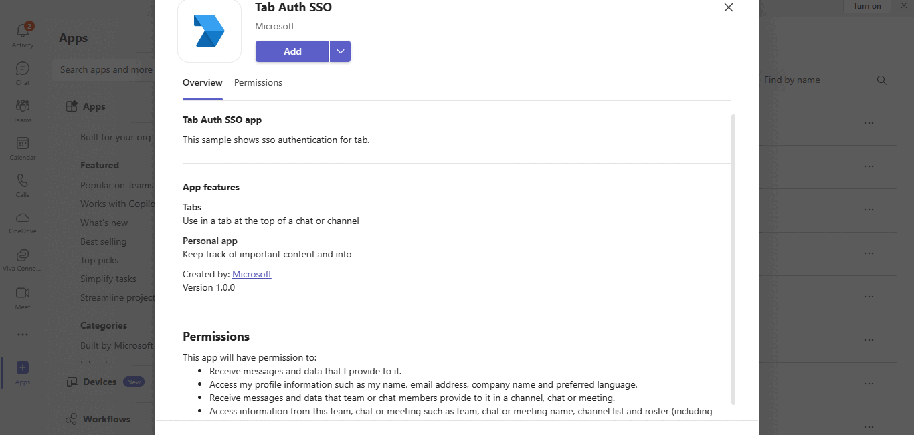
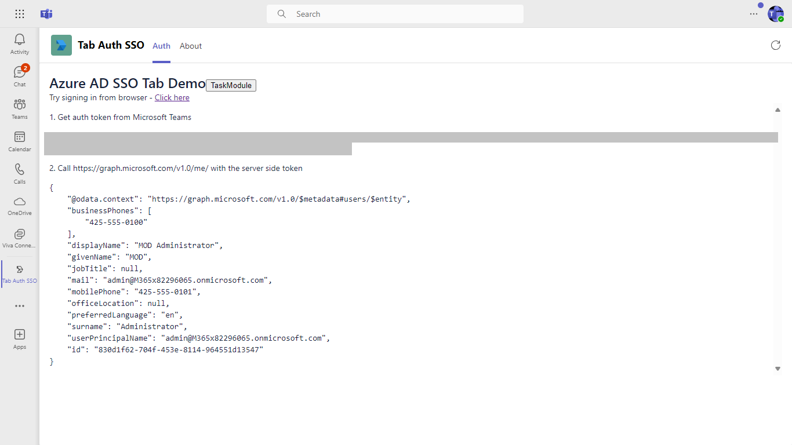
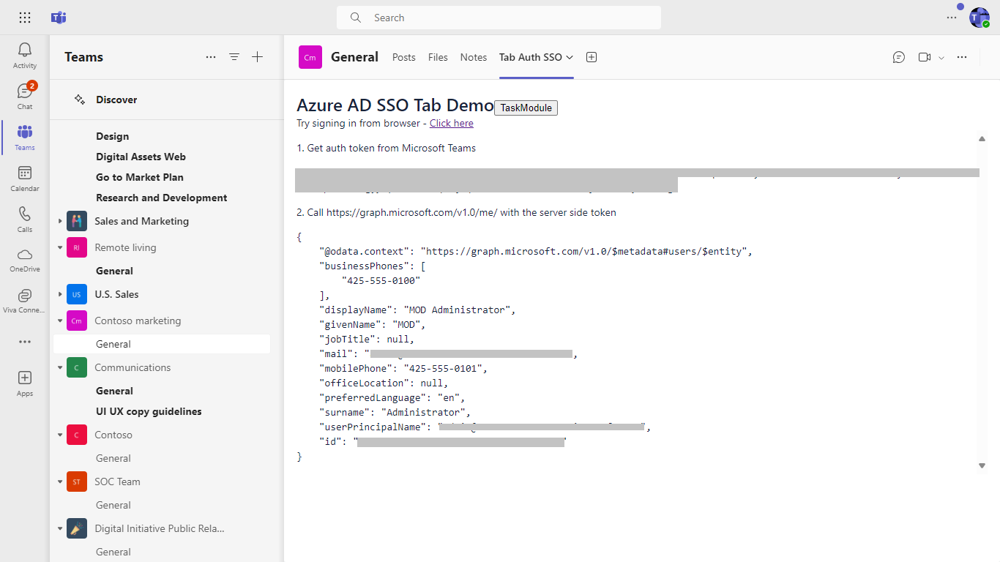
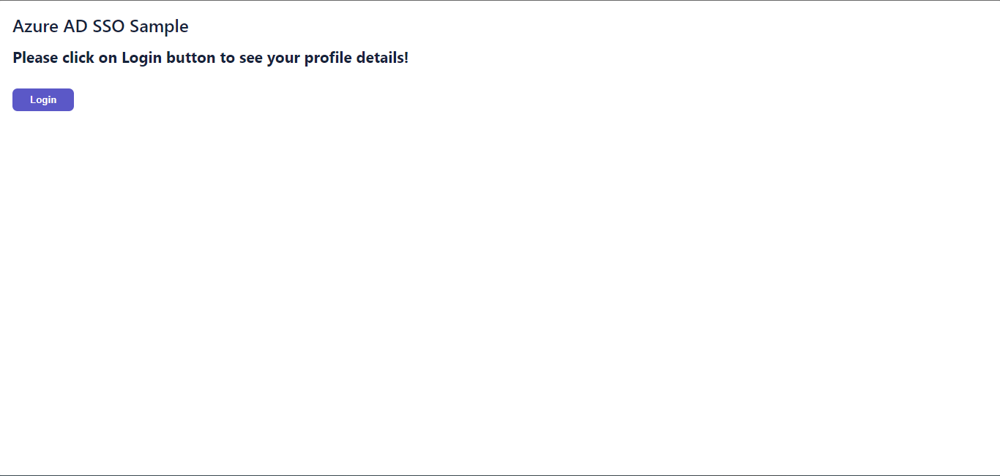
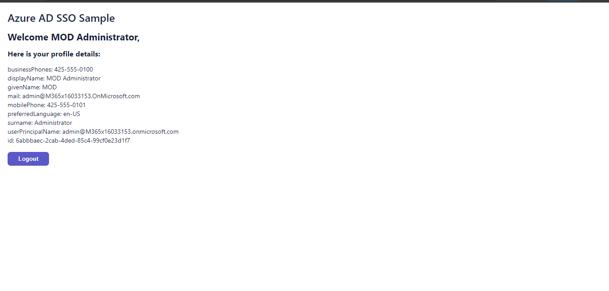
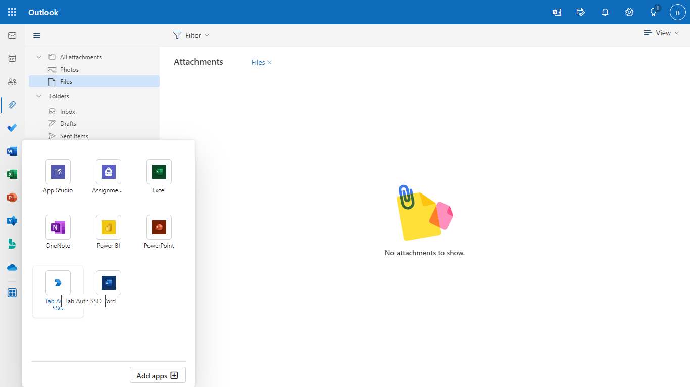
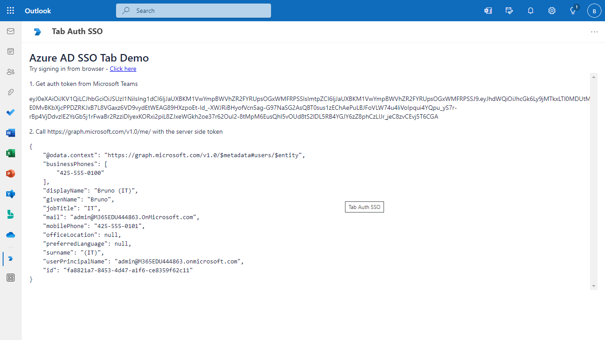
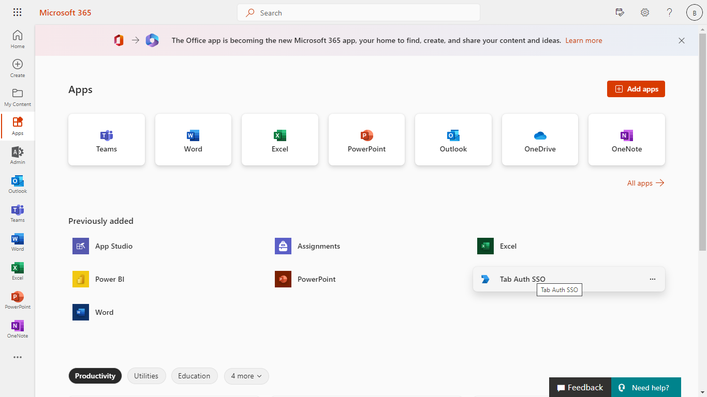
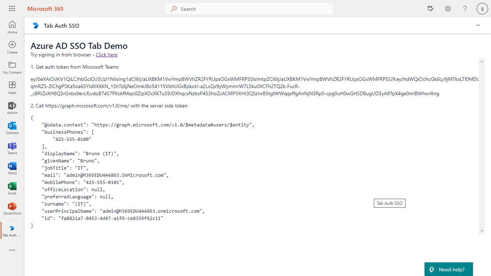

# Tabs Azure AD SSO Sample using NodeJS

This sample shows how to implement Azure AD single sign-on support for tabs. It will:

1. Obtain an access token for the logged-in user using SSO

2. Call a web service - also part of this project - to exchange this access token for one with User.Read permission

3. Call Graph and retrieve the user's profile

## Included Features
* Teams SSO (tabs)
* MSAL.js 2.0 support
* Graph API

- **Interaction with app**

## Prerequisites

You will need:

1. A global administrator account for an Office 365 tenant. Testing in a production tenant is not recommended! You can get a free tenant for development use by signing up for the [Office 365 Developer Program](https://developer.microsoft.com/en-us/microsoft-365/dev-program).

2. To test locally, [NodeJS](https://nodejs.org/en/download/) must be installed on your development machine.

3. [dev tunnel](https://learn.microsoft.com/en-us/azure/developer/dev-tunnels/get-started?tabs=windows) or [Ngrok](https://ngrok.com/download) (For local environment testing) latest version (any other tunneling software can also be used)
   If you using Ngrok to test locally, you'll need [Ngrok](https://ngrok.com/) installed on your development machine.
Make sure you've downloaded and installed Ngrok on your local machine. ngrok will tunnel requests from the Internet to your local computer and terminate the SSL connection from Teams.

4. [Teams Toolkit for VS Code](https://marketplace.visualstudio.com/items?itemName=TeamsDevApp.ms-teams-vscode-extension) or [TeamsFx CLI](https://learn.microsoft.com/microsoftteams/platform/toolkit/teamsfx-cli?pivots=version-one)

> NOTE: The free ngrok plan will generate a new URL every time you run it, which requires you to update your Azure AD registration, the Teams app manifest, and the project configuration. A paid account with a permanent ngrok URL is recommended.

## Run the app (Using Teams Toolkit for Visual Studio Code)

The simplest way to run this sample in Teams is to use Teams Toolkit for Visual Studio Code.

1. Ensure you have downloaded and installed [Visual Studio Code](https://code.visualstudio.com/docs/setup/setup-overview)
1. Install the [Teams Toolkit extension](https://marketplace.visualstudio.com/items?itemName=TeamsDevApp.ms-teams-vscode-extension)
1. Select **File > Open Folder** in VS Code and choose this samples directory from the repo
1. Using the extension, sign in with your Microsoft 365 account where you have permissions to upload custom apps
1. Select **Debug > Start Debugging** or **F5** to run the app in a Teams web client.
1. In the browser that launches, select the **Add** button to install the app to Teams.

> If you do not have permission to upload custom apps (sideloading), Teams Toolkit will recommend creating and using a Microsoft 365 Developer Program account - a free program to get your own dev environment sandbox that includes Teams.

## Run the app (Manually Uploading to Teams)

## Step 1: Register an Azure AD Application

Your tab needs to run as a registered Azure AD application in order to obtain an access token from Azure AD. In this step you'll register the app in your tenant and give Teams permission to obtain access tokens on its behalf.

1. Create an [Microsoft Entra ID application](https://docs.microsoft.com/en-us/microsoftteams/platform/tabs/how-to/authentication/auth-aad-sso#1-create-your-aad-application-in-azure) in Azure. You can do this by visiting the "Azure AD app registration" portal in Azure.

    * Set your application URI to the same URI you've created in tunnelling application. 
        * Ex: `api://<your_tunnel_domain>/{appId}`
        using the application ID that was assigned to your app
    * Setup your redirect URIs. This will allow Azure AD to return authentication results to the correct URI.
        * Visit `Manage > Authentication`. 
        * Add a platform
        * Select `Single-page application`
        * Create a redirect URI in the format of: `https://<your_tunnel_domain>/auth-end`.
        * Within same `Single-page-application` add another url in the format of: `https://<your_tunnel_domain>/Home/BrowserRedirect`.
    * Setup a client secret. You will need this when you exchange the token for more API permissions from your backend.
        * Visit `Manage > Certificates & secrets`
        * Create a new client secret.
    * Setup your API permissions. This is what your application is allowed to request permission to access.
        * Visit `Manage > API Permissions`
        * Make sure you have the following Graph permissions enabled: `email`, `offline_access`, `openid`, `profile`, and `User.Read`.
        * Our SSO flow will give you access to the first 4 permissions, and we will have to exchange the token server-side to get an elevated token for the `profile` permission (for example, if we want access to the user's profile photo).

    * Expose an API that will give the Teams desktop, web and mobile clients access to the permissions above
        * Visit `Manage > Expose an API`
        * Add a scope and give it a scope name of `access_as_user`. Your API url should look like this: `api://contoso.ngrok-free.app/{appID}/access_as_user`. In the "who can consent" step, enable it for "Admins and users". Make sure the state is set to "enabled".
        * Next, add two client applications. This is for the Teams desktop/mobile clients and the web client.
            * 5e3ce6c0-2b1f-4285-8d4b-75ee78787346
            * 1fec8e78-bce4-4aaf-ab1b-5451cc387264
    **Note** If you want to test or extend your Teams apps across Office and Outlook, kindly add below client application identifiers while doing Azure AD app registration in your tenant:
      * `4765445b-32c6-49b0-83e6-1d93765276ca` (Office web)
      * `0ec893e0-5785-4de6-99da-4ed124e5296c` (Office desktop)
      * `bc59ab01-8403-45c6-8796-ac3ef710b3e3` (Outlook web)
      * `d3590ed6-52b3-4102-aeff-aad2292ab01c` (Outlook desktop)

## Update the app manifest and config.js file

1. Update the `manifest.json` file as follows:

    * Generate a new unique ID for the application and replace the id field with this GUID. On Windows, you can generate a new GUID in PowerShell with this command:
    ~~~ powershell
     [guid]::NewGuid()
    ~~~
    * Ensure the package name is unique within the tenant where you will run the app
    * Edit the `manifest.json` contained in the ./appManifest folder to replace your Microsoft App Id (that was created when you registered your app registration earlier) *everywhere* you see the place holder string `{{AppId}}` (depending on the scenario the Microsoft App Id may occur multiple times in the `manifest.json`)
    * Replace `{your_tunnel_domain}` with the subdomain you've assigned to your Ngrok account in step #1 above.
    * Edit the `manifest.json` for `webApplicationInfo` resource `"api://{your_tunnel_domain}/{{AppId}}"` with MicrosoftAppId. E.g. `"api://1245.ngrok-free.app/{{AppId}}`.
    **Note:** If you want to test your app across multi hub like: Outlook/Office.com, please update the `manifest.json` in the `tab-sso\nodejs\appManifest_Hub` folder with the required values.
    **Zip** up the contents of the `appManifest` folder to create a `Manifest.zip` or `appManifest_Hub` folder to create a `Manifest_Hub.zip` (Make sure that zip file does not contains any subfolder otherwise you will get error while uploading your .zip package)

2. Update your `config/default.json` file
    * Replace the `tab.appId` property with you Azure AD application ID
    * Replace the `tab.clientSecret` property with the "client secret" you were assigned in step #2
    * Replace the `tab.applicationIdUri` property with the Application ID URI we get in step #1.1 above. It will look like this - `api://<your_tunnel_domain>/{appID}`
    * If you want to use a port other than 3978, fill that in here (and in your tunnel command)
    * Note : Do not push the `clientId` and `clientSecret` values inside your repo. Instead we recommend to store them at some secure location like Azure key vault.

## Running the app locally

1. If you are using Ngrok, run Ngrok to expose your local web server via a public URL. Make sure to point it to your Ngrok URI. For example, if you're using port 3978 locally, run: 
    * Win: `./ngrok http 3978 -host-header=localhost:3978 -subdomain="contoso"`
    * Mac: `/ngrok http 3978 -host-header=localhost:3978 -subdomain="contoso"`

Leave this running while you're running the application locally, and open another command prompt for the steps which follow.

2. Install the neccessary NPM packages and start the app
    * `npm install`
    * `npm start`

Thhe app should start running on port 3978 or the port you configured

## Packaging and installing your app to Teams

1. Package your manifest 
    * `gulp generate-manifest`
    * This will create a zip file in the manifest folder
2. Install in Teams
    * Open Teams and visit the app store. Depending on the version of Teams, you may see an "App Store" button in the bottom left of Teams or you can find the app store by visiting `Apps > Manage your apps > Publish App > Upload Custom App`.
    * Upload the manifest zip file created in step #1

## Running the sample

1. Once you've installed the app, it should automatically open for you. Visit the `Auth Tab` to begin testing out the authentication flow.
2. Follow the onscreen prompts. The authentication flow will print the output to your screen.

Tab auth in personal scope

Tab auth in group scope

Tab auth in browser

Tab auth in browser with user details

## Outlook on the web

- To view your app in Outlook on the web.

- Go to [Outlook on the web](https://outlook.office.com/mail/)and sign in using your dev tenant account.

**On the side bar, select More Apps. Your sideloaded app title appears among your installed apps**

**Select your app icon to launch and preview your app running in Outlook on the web**

**Note:** Similarly, you can test your application in the Outlook desktop app as well.

## Office on the web

- To preview your app running in Office on the web.

- Log into office.com with test tenant credentials

**Select the Apps icon on the side bar. Your sideloaded app title appears among your installed apps**

**Select your app icon to launch your app in Office on the web**

 

**Note:** Similarly, you can test your application in the Office 365 desktop app as well.

# App structure

## Routes

Compared to the Hello World sample, this app has four additional routes:
1. `/ssoDemo` renders the tab UI. 
    * This is the tab called `Auth Tab` in personal app inside Teams. The purpose of this page is primarily to execute the `ssoDemo.js` file that handles and initiates the authentication flow.
    * This tab can also be added to Teams channels
2. `/getProfileOnBehalfOf` does not render anything but instead is the server-side route for initiating the [on-behalf-of flow](https://docs.microsoft.com/en-us/azure/active-directory/develop/v1-oauth2-on-behalf-of-flow). 
    * It takes the token it receives from the `/ssoDemo` page and attemps to exchange it for a new token that has elevated permissions to access the `profile` Graph API (which is usually used to retrieve the users profile photo).
    * If it fails (because the user hasn't granted permission to access the `profile` API), it returns an error to the `/ssoDemo` page. This error is used to display the "Consent" button which uses the Teams SDK to open the `/auth/start` page in a pop-up window.
3. `/auth/start` and `/auth/end` routes are used if the user needs to grant further permissions. This experience happens in a seperate window. 
    * The `/auth/start` page merely creates a valid Microsoft Entra authorization endpoint and redirects to that Microsoft Entra ID consent page.
    * Once the user has consented to the permissions, Microsoft Entra ID redirects the user back to `/auth/end`. This page is responsible for returning the results back to the `/ssoDemo` page by calling the `notifySuccess` API.
    * This workflow is only neccessary if you want authorization to use additional Graph APIs. Most apps will find this flow unnesseccary if all they want to do is authenticate the user.
    * This workflow is the same as our standard [web-based authentication flow](https://docs.microsoft.com/en-us/microsoftteams/platform/tabs/how-to/authentication/auth-tab-aad#navigate-to-the-authorization-page-from-your-popup-page) that we've always had in Teams before we had single sign-on support. It just so happens that it's a great way to request additional permissions from the user, so it's left in this sample as an illustration of what that flow looks like.

## msal-auth.js

This Javascript file is served from the `/msal-auth.js` page and handles the browser-side authentication workflow.

## ssoDemo.js

This Javascript file is served from the `/ssoDemo` page and handles most of the client-side authentication workflow. This file is broken into three main functions:

1. getClientSideToken() -
This function asks Teams for an authentication token from Microsoft Entra ID. The token is displayed so you can try it in Postman.

2. getServerSideToken() -
This function sends the token to the backend to exchange for elevated permissions using Microsoft Entra ID's [on-behalf-of flow](https://docs.microsoft.com/en-us/azure/active-directory/develop/v1-oauth2-on-behalf-of-flow). In this case, it sends the token to the `/getProfileOnBehalfOf` route.

3. useServerSideToken() -
This function uses the token to call the Microsoft Graph and display the resulting JSON.

4. requestConsent() - 
This function launches the consent pop-up

Inline code runs these in sequence, running requestConsent only if an `invalid_grant` error is received from the server.

# Additional reading

 For how to get started with Microsoft Teams development see [Get started on the Microsoft Teams platform with Node.js and App Studio](https://docs.microsoft.com/en-us/microsoftteams/platform/get-started/get-started-nodejs-app-studio).

For further information on Single Sign-On and how it works, visit our [Single Sign-On documentation](https://docs.microsoft.com/en-us/microsoftteams/platform/tabs/how-to/authentication/auth-aad-sso)

# Contributing

This project welcomes contributions and suggestions.  Most contributions require you to agree to a
Contributor License Agreement (CLA) declaring that you have the right to, and actually do, grant us
the rights to use your contribution. For details, visit https://cla.microsoft.com.

When you submit a pull request, a CLA-bot will automatically determine whether you need to provide
a CLA and decorate the PR appropriately (e.g., label, comment). Simply follow the instructions
provided by the bot. You will only need to do this once across all repos using our CLA.

This project has adopted the [Microsoft Open Source Code of Conduct](https://opensource.microsoft.com/codeofconduct/).
For more information see the [Code of Conduct FAQ](https://opensource.microsoft.com/codeofconduct/faq/) or
contact [opencode@microsoft.com](mailto:opencode@microsoft.com) with any additional questions or comments.

## Further Reading.
[Extend Teams apps across Microsoft 365](https://learn.microsoft.com/en-us/microsoftteams/platform/m365-apps/overview)