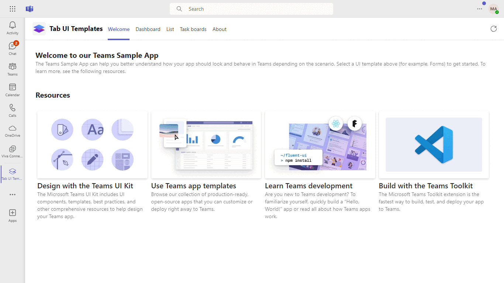
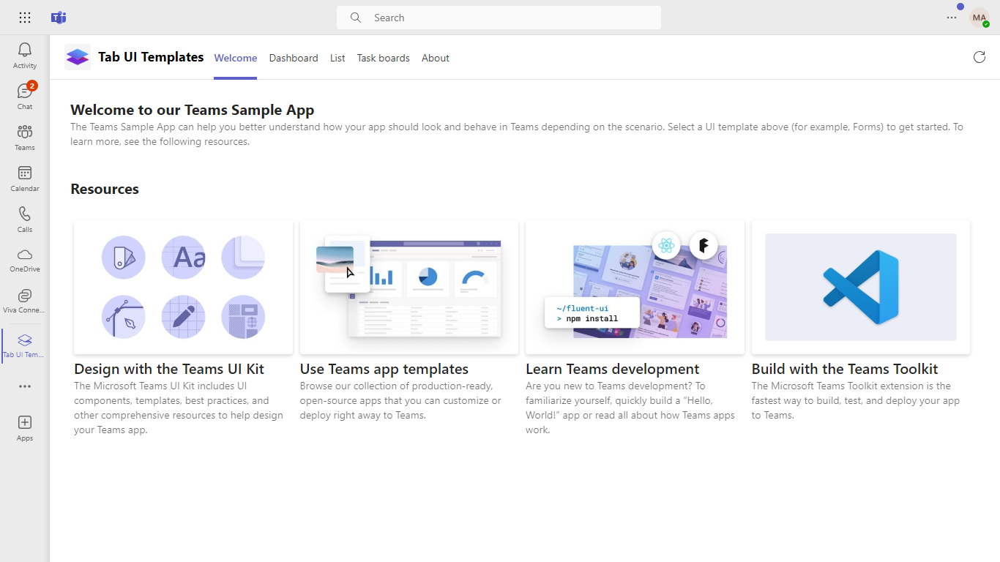
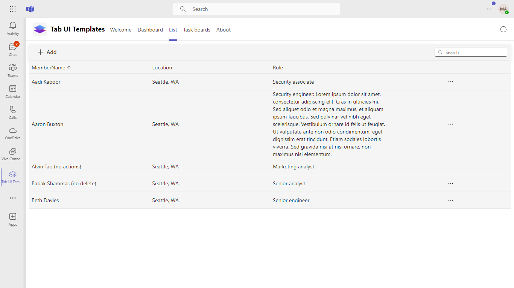
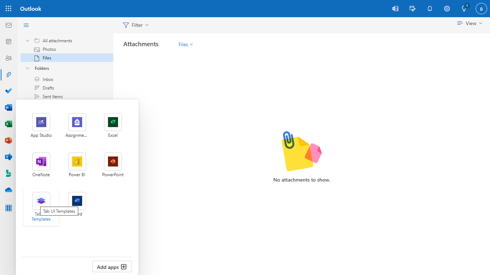
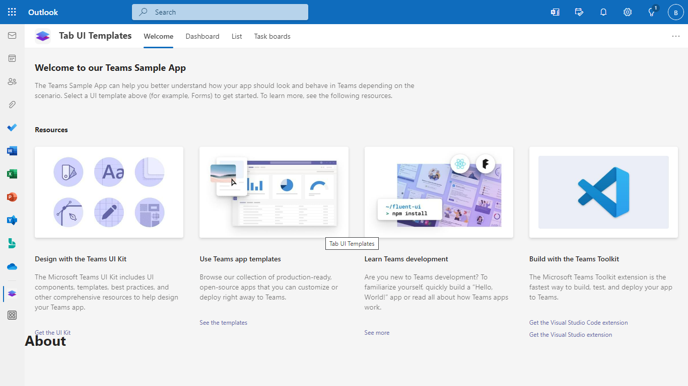
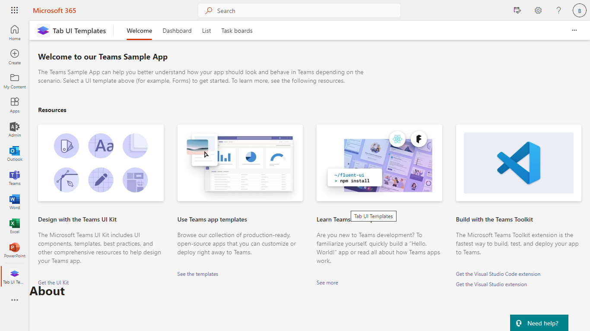

# Deploying the Microsoft Teams UI templates sample app

This sample app can help you better understand how apps should look and behave in Microsoft Teams. The app includes examples of tested, high-quality UI templates that work across common Teams use cases (such as dashboards or forms).

 ## Included Features
* Tabs
* UI Templates

## Interaction with tab


## Try it yourself - experience the App in your Microsoft Teams client
Please find below demo manifest which is deployed on Microsoft Azure and you can try it yourself by uploading the app package (.zip file link below) to your teams and/or as a personal app. (Sideloading must be enabled for your tenant, [see steps here](https://docs.microsoft.com/microsoftteams/platform/concepts/build-and-test/prepare-your-o365-tenant#enable-custom-teams-apps-and-turn-on-custom-app-uploading)).

**Teams UI templates:** [Manifest](/samples/tab-ui-templates/ts/demo-manifest/tab-ui-templates.zip)

## Prerequisites

- <a href="https://git-scm.com/" target="_blank">Install Git</a>
- [Node.js and npm](https://nodejs.org). Run the command `node --version` to verify that Node.js is installed.
- Set up a [Microsoft 365 developer account](https://docs.microsoft.com/microsoftteams/platform/build-your-first-app/build-first-app-overview#set-up-your-development-account), which allows app sideloading in Teams.

## Set up your app project

Open a terminal and clone the sample app repository.

```bash
git clone https://github.com/OfficeDev/Microsoft-Teams-Samples.git
cd Microsoft-Teams-Samples/samples/tab-ui-templates/ts
yarn install
```

You can find the app source code in `./src`:

- `app`: Includes the app scaffolding.

- `manifest`: Includes the app manifest (`manifest.json`) and the color and outline versions of the app icon.

- `assets`: Includes the app assets.

## Run the app

1. In the root directory of your project, run the following command.

   ```bash
   yarn start
   ```

   When the app starts, you should see the following terminal output.

   ```
     You can now view microsoft-teams-app-sample in the browser.
       Local:            http://localhost:3978
       On Your Network:  http://192.168.0.10:3978
   ```

2. Open a browser and verify that all of the following URLs load:
   - **Required Teams app pages**:
     - About: [http://localhost:3978](http://localhost:3978)
     - Privacy: [http://localhost:3978/#/privacy](http://localhost:3978/#/privacy)
     - Terms of use: [http://localhost:3978/#/termsofuse](http://localhost:3978/#/termsofuse)
   - **Sample app tabs**:
     - [http://localhost:3978/#/welcome](http://localhost:3978/#/welcome)
     - [http://localhost:3978/#/dashboard](http://localhost:3978/#/dashboard)
     - [http://localhost:3978/#/list](http://localhost:3978/#/list)
     - [http://localhost:3978/#/board](http://localhost:3978/#/board)

## Set up a secure tunnel to the app

Teams doesn't display app content unless it's accessible via HTTPS. We recommend using ngrok to establish a secure tunnel to where you're hosting the app locally (for example, `http://localhost:3978`).

1. Install [ngrok](https://ngrok.io).

1. Run ngrok - point to port 3978

```bash
# ngrok http 3978 --host-header="localhost:3978"
```

1. Save the HTTPS URL in the output (for example, https://468b9ab725e9.ngrok.io). You may need this later if you plan to register the app with App Studio.

> [!IMPORTANT]
> If you're using the free version of ngrok and plan to share the app with others, remember that ngrok quits if your machine shuts down or goes to sleep. When you restart ngrok, the URL also will be different. (A paid version of ngrok provides persistent URLs.)

## Create the app package
1) __*This step is specific to Teams.*__
    - **Edit** the `manifest.json` contained in the  `src/manifest` folder to replace `<<GUID_ID>>` with any GUID value.
    - **Edit** the `manifest.json` for `staticTabs` inside the `contentUrl` replace `<<HOSTNAME>>` with base Url domain. E.g. if you are using ngrok it would be `https://1234.ngrok.io` then your domain-name will be `1234.ngrok.io`. Replace the same value for `<<HOSTNAME>>` inside `validDomains` section.
    - **Note:** If you want to test your app across multi hub like: Outlook/Office.com, please update the `manifest.json` in the `tab-ui-templates\ts\src\Manifest_Hub` folder with the required values.
    - **Zip** up the contents of the `Manifest` folder to create a `Manifest.zip` or `Manifest_Hub` folder to create a `Manifest_Hub.zip` (Make sure that zip file does not contains any subfolder otherwise you will get error while uploading your .zip package)
    - **Upload** the `manifest.zip` to Teams (In Teams Apps/Manage your apps click "Upload an app". Browse to and Open the .zip file. At the next dialog, click the Add button.)
    - Add the app to personal scope.


## Sideload the app in Teams

1. In the Teams client, go to **Apps**.

1. Select **Upload a custom app** and upload the app package, which is the generated `zip` file in the `package` folder.

   

## Running the sample

- Welcome Page


- Dashboard Page


- List Page


- Board Page


## Outlook on the web

- To view your app in Outlook on the web.

- Go to [Outlook on the web](https://outlook.office.com/mail/)and sign in using your dev tenant account.

**On the side bar, select More Apps. Your sideloaded app title appears among your installed apps**



**Select your app icon to launch and preview your app running in Outlook on the web**



**Note:** Similarly, you can test your application in the Outlook desktop app as well.

## Office on the web

- To preview your app running in Office on the web.

- Log into office.com with test tenant credentials

**Select the Apps icon on the side bar. Your sideloaded app title appears among your installed apps**


**Select your app icon to launch your app in Office on the web**

 

**Note:** Similarly, you can test your application in the Office 365 desktop app as well.

## Next steps

- Design your Teams app with [UI templates](https://docs.microsoft.com/microsoftteams/platform/concepts/design/design-teams-app-ui-templates).
- Implement UI templates with the [Microsoft Teams UI Library](https://www.npmjs.com/package/@fluentui/react-teams).

 ## Further reading

- [Tabs](https://learn.microsoft.com/microsoftteams/platform/tabs/what-are-tabs)
- [Extend Teams apps across Microsoft 365](https://learn.microsoft.com/microsoftteams/platform/m365-apps/overview)